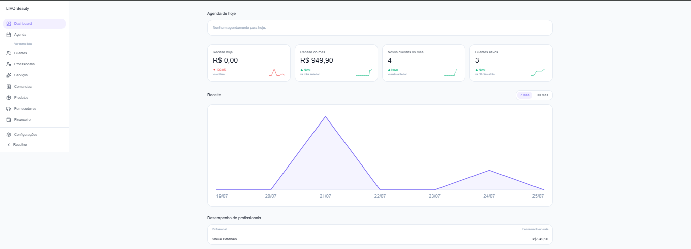
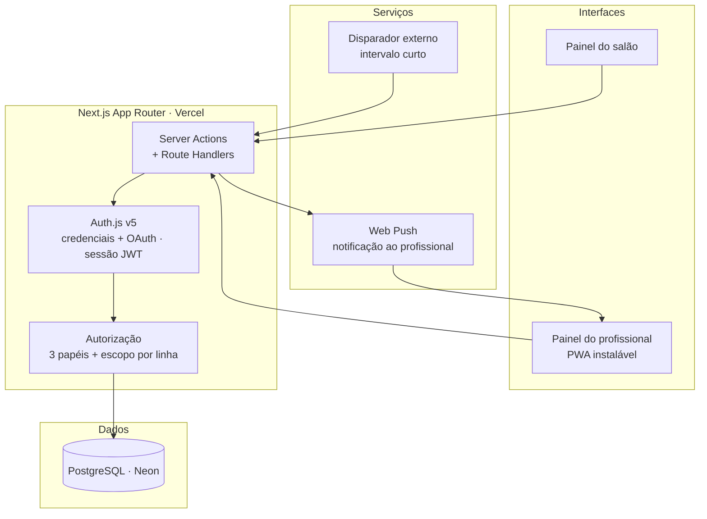

<h1 align="center">LIVO Beauty</h1>

<p align="center">
  <strong>SaaS multi-tenant para salões de beleza e clínicas de estética</strong><br>
  Agenda, clientes, estoque e financeiro para negócios que operam com profissionais em regime de parceria.
</p>

<p align="center">
  
  
  
  
  
</p>

<p align="center">
   <!-- [PRINT] -->
</p>

---

## O problema

Salão de beleza e clínica de estética têm uma diferença estrutural em relação a outros negócios de serviço: boa parte dos profissionais não é funcionária, é parceira. Cada uma tem seu próprio percentual, seus próprios clientes e, muitas vezes, seus próprios produtos.

Isso quebra o modelo financeiro dos sistemas de gestão comuns. O faturamento entra na conta do salão, mas uma fatia dele nunca foi do salão — é repasse. Tratar esse valor como receita produz um caixa fictício e uma decisão de negócio errada no fim do mês.

O LIVO Beauty foi construído em cima do problema do repasse, não ao lado dele.

## Status

Segundo produto do ecossistema LIVO, construído sobre a mesma arquitetura base e adaptado às regras do segmento. Desenvolvido individualmente, do zero à produção.

|                                |                                       |
| ------------------------------ | ------------------------------------- |
| Módulos do MVP entregues       | 7 de 9                                |
| Perfis de acesso               | 3 (proprietário, staff, profissional) |
| Modos de liquidação financeira | 2 (parcial e total)                   |

**Entregues:** Fundação · Profissionais e Serviços · Agenda · Clientes · Produtos e Estoque · Financeiro · Relatórios

---

## Arquitetura



---

## Decisões técnicas

### O repasse ao profissional é um passivo, não uma despesa de caixa

Quando um atendimento é fechado, a comissão da profissional passa a existir como **conta a pagar**, e não como saída imediata. O caixa só é afetado quando o repasse é efetivamente confirmado.

A diferença aparece na prática: sem isso, o relatório mostra o salão com menos dinheiro do que realmente tem em caixa, e o dono toma decisão de compra e contratação em cima de um número que não corresponde à realidade.

O sistema suporta **dois modos de liquidação — parcial e total** — com conciliação automática das comissões pendentes em ambos.

### Precisão decimal exata no pipeline de preços

Valores monetários trafegam como string decimal ao longo de todo o cálculo — preço do serviço, desconto, percentual de comissão, repasse — e só são convertidos nas fronteiras.

Ponto flutuante acumula erro de arredondamento, e num fechamento mensal isso aparece como centavos que ninguém consegue justificar. Num sistema onde a profissional confere o próprio repasse, um centavo inexplicável custa a confiança dela no produto inteiro.

### Isolamento multi-tenant por linha, validado em leitura e escrita

Cada registro carrega o identificador do estabelecimento, e o filtro é aplicado nas duas direções. Filtrar apenas a leitura protege contra vazamento, mas deixa passar escrita forjada em registro de outro tenant.

Durante uma revisão do próprio código encontrei exatamente esse caso — uma rota de escrita sem o filtro de escopo. A correção virou padrão: nenhuma operação chega ao ORM sem passar por sessão, papel e tenant.

### Notificação em tempo real sem custo adicional de infraestrutura

A profissional precisa saber do agendamento no momento em que ele acontece. WebSocket ou serviço gerenciado de push resolveriam, mas ambos adicionam custo fixo mensal a um produto ainda validando receita.

Implementei com **Web Push nativo em PWA instalável**, contornando o limite de execução de cron do plano de hospedagem através de um disparador externo com intervalo curto.

**Trade-off assumido:** latência de poucos minutos em vez de instantânea — aceitável para agendamento, e revisável quando a receita justificar.

### Reaproveitamento da arquitetura entre verticais

O LIVO Beauty não é um fork do LIVO Barber. As regras de domínio que mudam entre os segmentos — modelo de comissão, tipos de serviço, fluxo de atendimento — foram isoladas da fundação comum de autenticação, tenant, agenda e financeiro.

O resultado é o que valida a decisão: uma segunda vertical completa em produção, sem duplicar a base.

---

## Stack

| Camada             | Tecnologias                                  |
| ------------------ | -------------------------------------------- |
| **Framework**      | Next.js (App Router), TypeScript             |
| **UI**             | Tailwind CSS v4, shadcn/ui                   |
| **Autenticação**   | Auth.js v5 — credenciais + OAuth, sessão JWT |
| **Autorização**    | 3 papéis, isolamento multi-tenant por linha  |
| **Banco de dados** | PostgreSQL (Neon), Prisma v7                 |
| **Notificações**   | Web Push, PWA instalável                     |
| **Infraestrutura** | Vercel                                       |

---

## Rodando localmente

```bash
git clone https://github.com/degasdegani/livo-beauty.git
cd livo-beauty
npm install
cp .env.example .env   # preencha as variáveis
npx prisma migrate dev
npm run dev
```

| Variável                                 | Descrição                                             |
| ---------------------------------------- | ----------------------------------------------------- |
| `DATABASE_URL`                           | String de conexão do PostgreSQL                       |
| `AUTH_SECRET`                            | Chave de assinatura da sessão                         |
| `AUTH_GOOGLE_ID` / `AUTH_GOOGLE_SECRET`  | Credenciais do OAuth Google                           |
| `VAPID_PUBLIC_KEY` / `VAPID_PRIVATE_KEY` | Chaves do Web Push [PREENCHER: confirmar nomes reais] |

---

## Roadmap

- [x] Fundação, autenticação e multi-tenant
- [x] Profissionais, serviços e comissionamento
- [x] Agenda e clientes
- [x] Produtos e estoque
- [x] Financeiro com conciliação de repasses
- [x] Relatórios

---

## Autor

**Eduardo Degani** — Desenvolvedor Full Stack
[LinkedIn](https://linkedin.com/in/eduardo-degani) · [GitHub](https://github.com/degasdegani) · contatodegani@gmail.com

Produto comercial do ecossistema LIVO. Repositório público para avaliação técnica.
